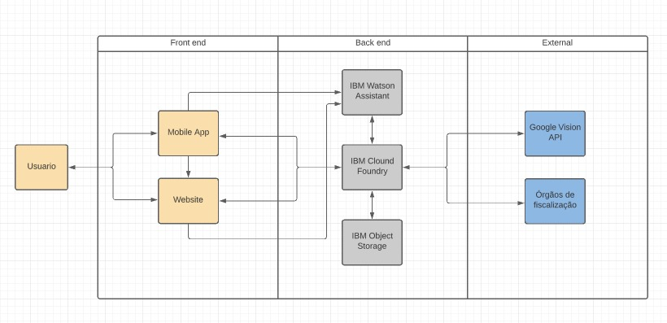

# Call for Code 2021 [#callforcode](https://www.linkedin.com/feed/hashtag/callforcode/)
### Uma semana de muita diversão:

Somos o "Grupo 4", conformado por:

- [Zivile](https://www.linkedin.com/in/zivile-valutyte-silveira/)
- [Elaine Lemos](https://www.linkedin.com/in/julian-gamboa-bahia/)
- [Rodrigo Fukugauti](https://www.linkedin.com/in/rodrigofukugauti/)
- [Lucas](https://www.linkedin.com/in/julian-gamboa-bahia/)
- [Julian Gamboa](https://www.linkedin.com/in/julian-gamboa-bahia/)

### Introdução: 

Mudança climática já está acontecendo e tem potencial de afetar a vida de cada um. Todos nós temos a responsabilidade de procurar a melhor maneira de consumir, de produzir, de preservar nosso meio ambiente e seus recursos. Temos que ser conscientes de suas ações, atentos ao nosso impacto, pequeno que pensamos que seja. A sinergia das ações individuais move a comunidade e cria impacto considerável na aplicação das leis e regulamentações. A pressão da comunidade contribui diretamente com aumento da produção compatível com as melhores práticas da produção consciente, especialmente no nível da produção industrial e grande escala.

Pensando nisso, nós imaginamos um aplicativo de celular que através da tecnologia do Watson Assistant, da geolocalização e reconhecimento de imagens coleta observações, queixas e denúncias dos crimes ambientais e direciona elas para as instituições ou grupos responsáveis pelas aplicações das medidas necessárias. Esses registros depois de identificados e processados iam ser direcionados para os órgãos ou grupos responsáveis e acompanhados pela pessoa que os iniciou. Também teríamos um website de apoio. Cada um poderia ser observador consciente e atento e registar um despejo irregular no solo ou nas águas, queimada irresponsável ou qualquer outro tipo de crime ambiental.

Além dessa funcionalidade, nós queremos envolver a comunidade com os desafios sobre a sustentabilidade (exemplos como a segunda sem carne, montagem da composteira) e compartilhar as melhores práticas. Para incentivar ainda mais gostaríamos de envolver os usuários no jogo e uma coleta de recompensas. Procuramos criar um lugar onde poderíamos nos inspirar e melhorar nossa maneira de consumir, produzir e preservar nosso meio ambiente.

Coletando os dados sobre denúncias, queixas e os sentimentos dos usuários seria possível oferecer insights para que as empresas possam melhorar os pontos da sua cadeia de produção mais expostos e sensíveis e aumentar o valor das marcas demonstrando a preocupação e o alinhamento com os valores que são importantes para o nosso meio ambiente. Um ganho para os dois lados.

Todos nós podemos fazer a diferença, mas juntos somos mais fortes!

### Métodologia: 

Conversando com os mentores [Zeca Novaes](https://www.linkedin.com/in/zeca-novaes/) , [Fabiano NagaMatsu](https://www.linkedin.com/in/fabianonagamatsu/) e estudando muito os produtos IBMs , foi possível:
- Usar uma arquitetura frequentemente comentada na documentação IBM CLOUD 
- A construção do **"Produto Minimo"** integrando tanto o backend como o frontend desenvolvido de forma separada.

### Produto Informático: 

Um sistema de fácil acesso, desde qualquer dispositivo que teha internet seja telefone celular Smartfone ou computador tradicional Desktop , para registrar e centralizar eventualidades relacionadas com o meio ambiente, severos desequilibros climáticos, etc.

### Resumo: 

Faltando uma semana para o evento [GLOBAL](https://developer.ibm.com/callforcode/) esperamos ter aceitação de jurados e mentores para poder continuar neste interessante desafío onde a informática é usada para desenvolver uma ferramenta socio-ambiental.

