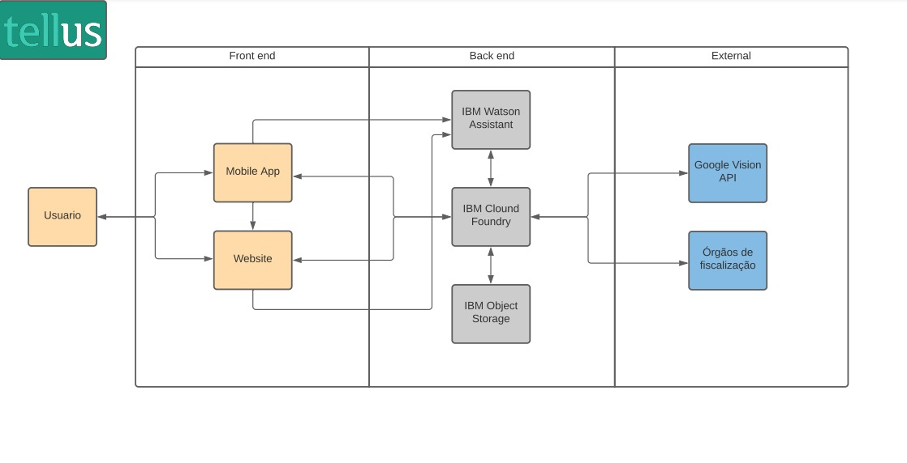

# Call for Code 2021 [#callforcode](https://www.linkedin.com/feed/hashtag/callforcode/)
### Uma semana de muita diversão:

Somos o "Grupo 4", conformado por:

- [Zivile](https://www.linkedin.com/in/zivile-valutyte-silveira/)
- [Elaine Lemos](https://www.linkedin.com/in/julian-gamboa-bahia/)
- [Rodrigo Fukugauti](https://www.linkedin.com/in/rodrigofukugauti/)
- [Luca Luz](https://www.linkedin.com/in/luc4luz)
- [Julian Gamboa](https://www.linkedin.com/in/julian-gamboa-bahia/)

### Introdução: 

Mudança climática já está acontecendo e tem potencial de afetar a vida de cada um. Todos nós temos a responsabilidade de procurar a melhor maneira de consumir, de produzir, de preservar nosso meio ambiente e seus recursos. Temos que ser conscientes de suas ações, atentos ao nosso impacto, pequeno que pensamos que seja. A sinergia das ações individuais move a comunidade e cria impacto considerável na aplicação das leis e regulamentações. A pressão da comunidade contribui diretamente com aumento da produção compatível com as melhores práticas da produção consciente especialmente no nível da produção industrial e grande escala.
 Pensando nisso, criamos o Tellus, um aplicativo capaz de coletar observações através da tecnologia do Watson Assistant, da geolocalização através do reconhecimento de metadados das imagens coletadas e da classificação do conteúdo usando a API Google Vision, sendo que todos os dados são armazenados no IBM Cloud Object Storage. O processamento das informações é realizado via API instanciada usando o recurso Cloud Foundry na IBM Cloud.
Assim, possibilitando o envio de queixas e denúncias de crimes ambientais através da nossa chatbot, Tais: Tellus Artificial Intelligence Service. Com ela, é possível fazer sua denúncia em total anonimato e de forma descomplicada e muito intuitiva. Esses dados são direcionados para as instituições e grupos responsáveis pelas aplicações das medidas necessárias e posteriormente são retornados e disponibilizados para acompanhamento pelo nosso website, também são exibidos em forma de rankeamento de empresas com seus respectivos impactos categorizados.

Além dessa funcionalidade, nós queremos envolver a comunidade com os desafios sobre a sustentabilidade (exemplos como a segunda sem carne, montagem da composteira) e compartilhar as melhores práticas. Para incentivar ainda mais gostaríamos de envolver os usuários no jogo e uma coleta de recompensas. Procuramos criar um lugar onde poderíamos nos inspirar e melhorar nossa maneira de consumir, produzir e preservar nosso meio ambiente.
Coletando os dados sobre denúncias, queixas e os sentimentos dos usuários seria possível oferecer insights para que as empresas possam melhorar os pontos da sua cadeia de produção mais expostos e sensíveis e aumentar o valor das marcas demonstrando a preocupação e o alinhamento com os valores que são importantes para o nosso meio ambiente. Um ganho para os dois lados.

**Todos nós podemos fazer a diferença, mas juntos somos mais fortes!**
 
 
 
 

### Métodologia: 

Conversando com os mentores [Zeca Novaes](https://www.linkedin.com/in/zeca-novaes/) , [Fabiano NagaMatsu](https://www.linkedin.com/in/fabianonagamatsu/) e estudando muito os produtos IBMs , foi possível:
- Usar uma arquitetura frequentemente comentada na documentação IBM CLOUD 
- A construção do **"Produto Minimo"** integrando tanto o backend como o frontend desenvolvido de forma separada.
- A construção do backend deste **"Produto Minimo"** permitiou aproveitar os aprendizados conquistadas nas edições anteriores da [Maratona IBM BHTC 2020 e 2021](https://maratona.dev/en), usando assim diversos serviços e produtos da cloud IBM.
- A construção do front-end deste **"Produto Minimo"** foi focada na tecnologia HTML dado que era preciso trabalhar de forma remota com máxima simplicidade. Seguidamente será usado o poderosso framewrok Angular aproveitando a facilidade de migração dos códigos HTML já testados e usados para o sistema Angular. 

### Produto Informático: 

Um sistema de fácil acesso, desde qualquer dispositivo que tenha internet seja telefone celular Smartphone ou computador tradicional Desktop , para registrar e centralizar eventualidades relacionadas com o meio ambiente, severos desequilíbrios climáticos, etc.

Foi mantido como critério essencial de desenho a "simplicidade da interface de usuário" motivo pelo qual foram trabalhadas telas responsivas e um "chatbot" para criar um diálogo simples, fácil para qualquer público seja este da "zona rural" ou das grandes metrópoles.

Sem dúvida que não serão poucos os aprimoramentos e futuras versões deste sistema motivados pela ampla utilidade socio-ambiental do mesmo, e considerando que o problema socio-ambiental que tenta contornar é um problema complexo com diversas interpretações. Um dos aprimoramentos está relacionado com a inteligência artificial atrelada ao chatbot que pode ser ajustadas conforme cada "idiossincrasia regional".

### Resumo: 

Faltando uma semana para o fechamento do evento [GLOBAL](https://developer.ibm.com/callforcode/) esperamos ter aceitação de jurados e mentores e assim poder continuar neste interessante desafío onde a informática é usada para desenvolver uma ferramenta socio-ambiental.

